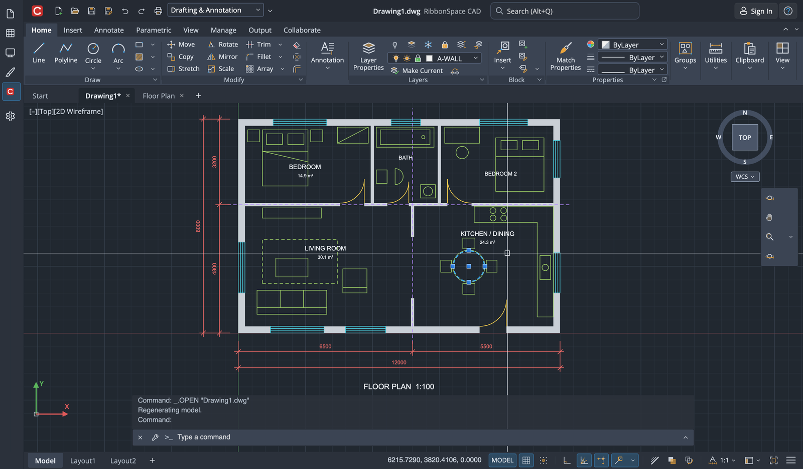
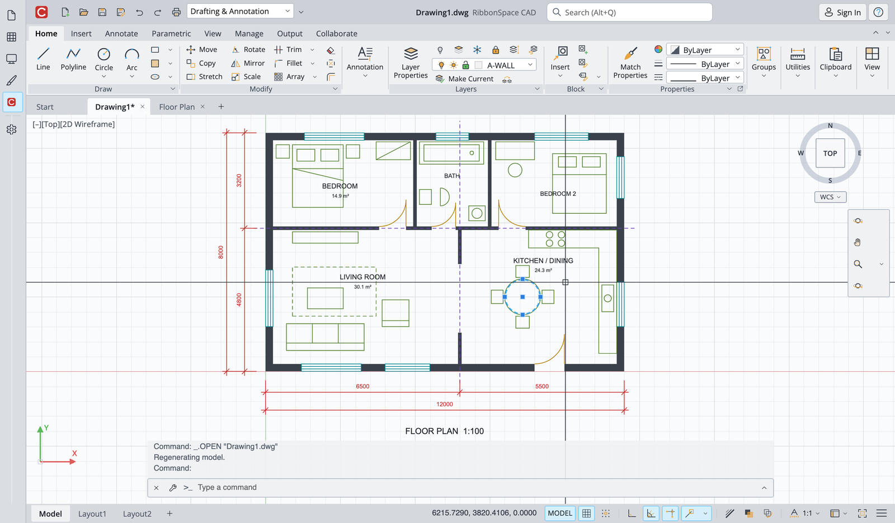
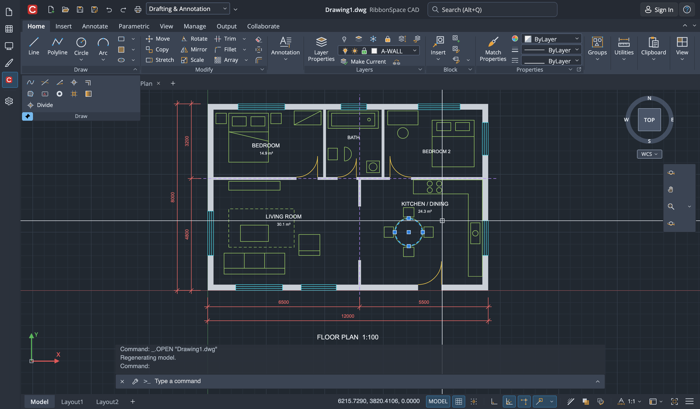
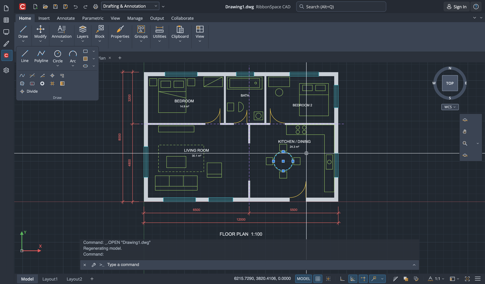
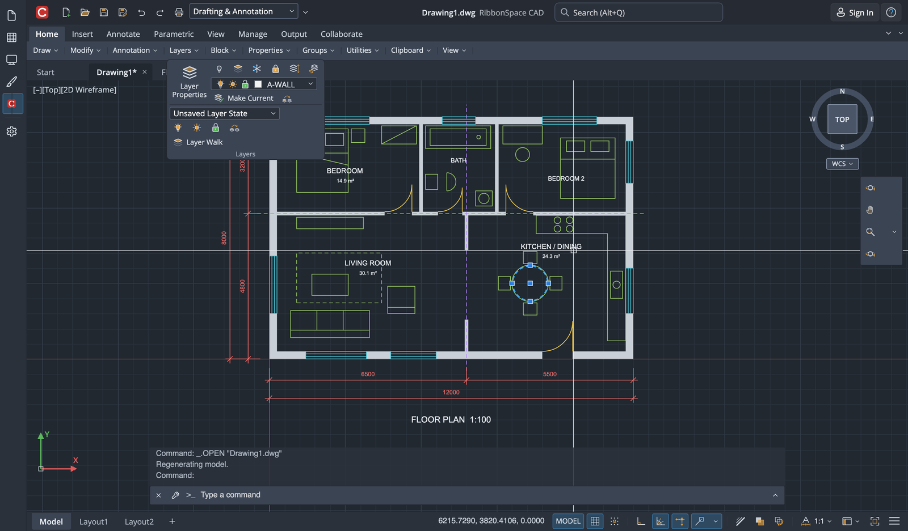
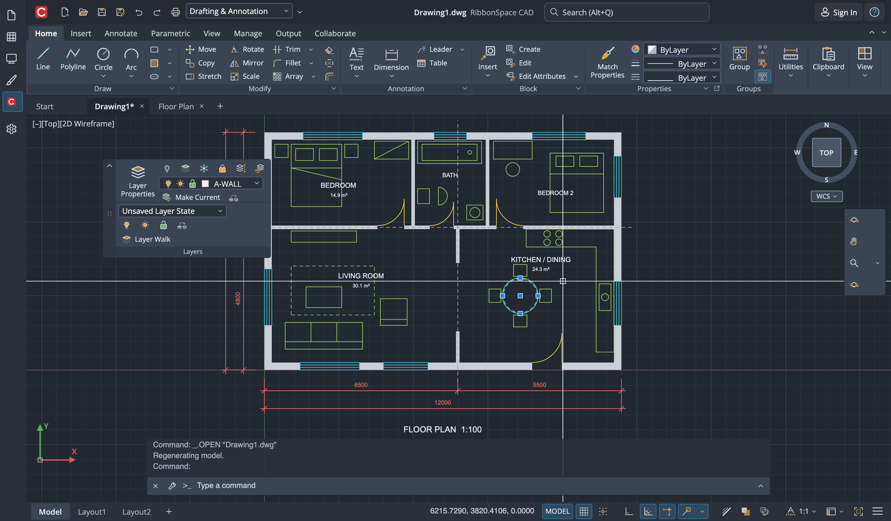
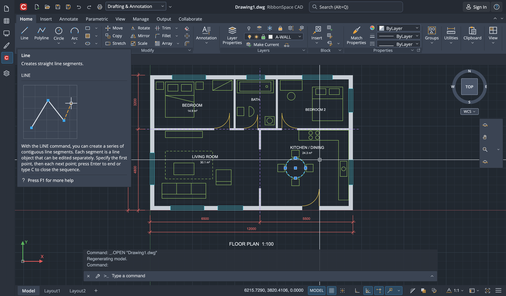
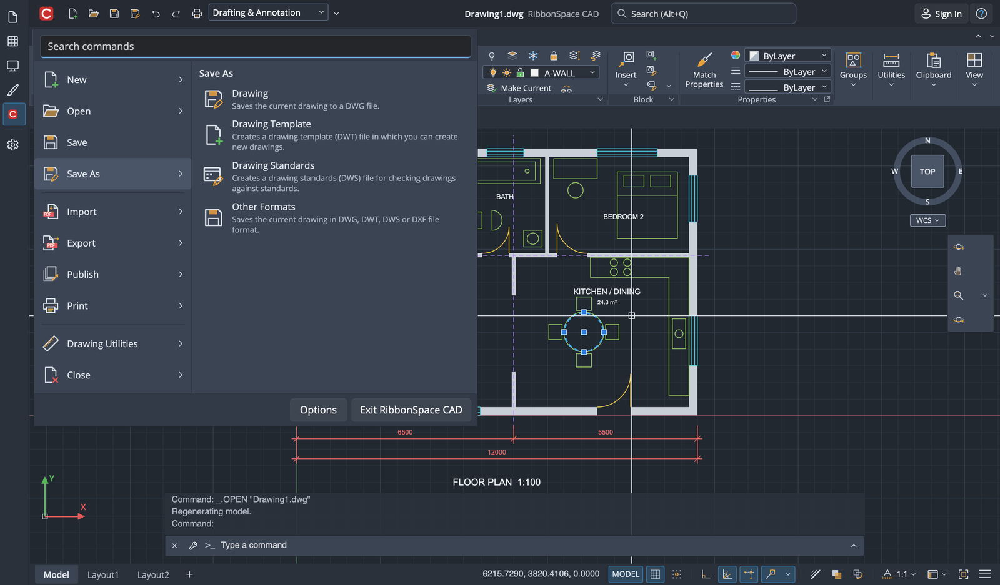
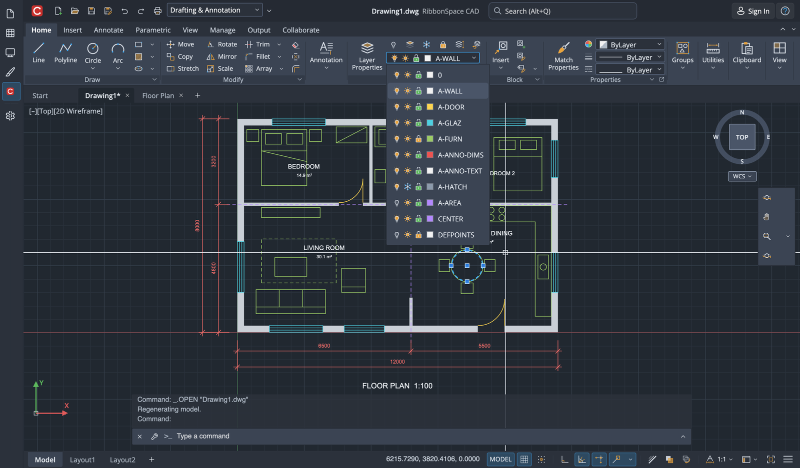

# CAD ribbons (AutoCAD-style)

RibbonSpace covers the ribbon features of AutoCAD-class drafting applications in addition to Office's. They are all
opt-in, so Office-style ribbons are unchanged. The gallery's **CAD** page combines them into a complete drafting
workspace.



| Feature | API |
|---|---|
| CAD look (blue-grey surfaces, panel title bars, flat tabs, square corners) | `RibbonThemeStyle.Cad`, `RibbonThemePalette.Cad` |
| Expanded panels with a pushpin | `RibbonGroup.SlideOutItems`, `IsSlideOutPinned` |
| Minimize to tabs / panel titles / panel buttons, or cycle through all | `Ribbon.MinimizeBehavior`, `VisibilityMode`, `IsMinimizeButtonVisible` |
| Floating panels | `Ribbon.CanFloatGroups`, `RibbonGroup.Float()`, `ReturnToRibbon()` |
| Right-click Show Tabs / Show Panels / Show Panel Titles | `Ribbon.IsVisibilityMenuEnabled`, `ShowGroupCaptions` |
| Progressive (basic → extended) tooltips | `RibbonScreenTip.ExtendedDescription`, `ExtendedImage` |
| Application menu with search, sub-commands and recent documents | `RibbonApplicationMenu` |
| Layer / colour / linetype / lineweight drop-downs | `RibbonComboBox.ItemTemplate`, `SelectionBoxTemplate` |
| Line-art, multi-colour command icons | layered path icons (`RibbonIcon.Stroke`, `RibbonIcon.Layers`) |
| Important panels stay large, minor ones collapse first | `Ribbon.ReductionStrategy="GroupByGroup"` + `RibbonGroup.ReductionOrder` |
| Application button on the title bar | `RibbonTitleBar.IsAppIconMenuEnabled` |
| Icon-only status bar toggles | `RibbonStatusBar.ShowLabels="False"` |

## CAD theme

```csharp
RibbonTheme.Apply(RibbonThemePalette.Cad, RibbonChromeStyle.Neutral, RibbonThemeStyle.Cad);
RibbonTheme.SetTheme((FrameworkElement)window.Content, ElementTheme.Dark); // CAD apps usually default to dark
```

`RibbonThemeStyle.Cad` changes the surfaces in both the dark and the light theme:
- the command bar runs edge to edge, with square corners;
- the selected tab is a filled tab that joins the panels, with no underline;
- each panel has a title bar;
- popups and inputs use blue-grey colours.

The accent palette still drives focus, checked and selection colours, so any palette can be combined with the CAD
style.

Colours update live. Shape resources (corner radii and margins, see `RibbonThemeResources.ShapeKeys`) are read when a
control is templated. Switch the style before creating the page, or recreate the page after switching. The new brush
keys are `RibbonGroupCaptionBackgroundBrush`, `RibbonGroupCaptionForegroundBrush`, `RibbonTabSelectedBackgroundBrush` and
`RibbonFloatingPanelBarBrush`.

`Density="Compact"` gives the denser AutoCAD proportions. `ReductionStrategy="GroupByGroup"` shrinks the least
important panel (highest `ReductionOrder`, ties rightmost) all the way to a panel button before the next panel shrinks,
so key panels stay large, as in AutoCAD. The default, `Stepwise`, is Office's: all panels go to Medium, then Small, then
collapse.



## Expanded panels

Less frequently used commands go into `SlideOutItems`. The panel title then shows an arrow that opens them below the
panel, like AutoCAD's expanded panels:

```xml
<RibbonGroup Header="Draw">
  <RibbonButton Label="Line" Icon="…" Size="Large" />
  <RibbonGroup.SlideOutItems>
    <RibbonButton Label="Construction Line" Icon="…" />
    <RibbonButton Label="Ray" Icon="…" />
  </RibbonGroup.SlideOutItems>
</RibbonGroup>
```

- **Opening and closing:** the expanded part closes when you click elsewhere. The pushpin (`IsSlideOutPinned`) keeps it
  open; a pinned panel reopens whenever its tab is selected again. Esc closes it.
- **Other presentations:** when the group is collapsed, shown as a panel button or a panel title, or floating, the
  expanded commands appear below the main ones inside the popup or floating panel. In the simplified ribbon they
  appear in the ⋯ menu.
- **Discovery:** the commands are found by search, KeyTips (the arrow has its own KeyTip), shortcuts and
  `FindItem`. They can be added to the Quick Access Toolbar. In MVVM, use `RibbonGroupModel.SlideOutItems`.



## Minimize states

AutoCAD can minimize the ribbon to the tabs, to the panel titles, or to one button per panel. RibbonSpace adds the two
panel states to `RibbonVisibilityMode`:

| `VisibilityMode` | Shows |
|---|---|
| `AlwaysShow` | the full ribbon |
| `PanelButtons` | one button per panel (icon and title); clicking opens the full panel below it |
| `PanelTitles` | only the panel titles; clicking a title opens the panel |
| `TabsOnly` | only the tabs (Office's "Show tabs only") |

`MinimizeBehavior` decides what `ToggleMinimized` does. This covers Ctrl+F1, double-clicking a tab and the minimize
button.

| `MinimizeBehavior` | Effect |
|---|---|
| `Tabs` | full ribbon ↔ tabs only (Office) |
| `PanelTitles` | full ribbon ↔ panel titles |
| `PanelButtons` | full ribbon ↔ panel buttons |
| `CycleAll` | full ribbon → panel buttons → panel titles → tabs → full ribbon |

`IsMinimizeButtonVisible="True"` adds AutoCAD's minimize button at the end of the tab row. The button applies the next
state, and its arrow picks the behaviour. The two panel states also appear in the display options menu when the
minimize behaviour or the minimize button use them. `IsMinimized` is true in all three minimized states. Both settings
are saved in `RibbonState`.




## Floating panels

With `CanFloatGroups="True"`, a panel can be floated in two ways: drag its title away from the ribbon, or choose
**Float Panel** from its context menu (or call `group.Float(position)`).

- **The floating panel:** it has a side bar with a grip for dragging and a **return to ribbon** button. It stays open
  when other tabs are selected.
- **Returning panels:** use **Return Panel(s) to Ribbon**, `ReturnToRibbon()` or `ribbon.ReturnAllPanelsToRibbon()`.
- **API:** `FloatingGroups` lists the floating panels and `GroupFloatingChanged` reports changes.
- **Persistence:** positions are saved in `RibbonState.FloatingGroups` and restored with the state.
- **Hidden hosts:** floating panels and other popups close when the ribbon is unloaded or its own `Visibility`
  collapses. Hosts that hide an ancestor instead (pages in a tab control, for example) call `ribbon.SuspendPopups()`
  and `ribbon.ResumePopups()`.



## Show Tabs, Show Panels, Show Panel Titles

With `IsVisibilityMenuEnabled="True"`, the ribbon context menu gains AutoCAD's visibility menus:
- **Show Tabs**: a checkable entry per tab.
- **Show Panels**: the panels of the selected tab.
- **Show Panel Titles**: toggles `ShowGroupCaptions`.

Hidden tabs and panels are stored in the customization (`HiddenTabIds`, `HiddenGroupIds`), so the customize dialog and
`RibbonState` stay consistent.

## Progressive tooltips

A ScreenTip first shows its title, description and shortcut. If the pointer stays on the command, it extends with
`ExtendedDescription` and `ExtendedImage`, as AutoCAD's tooltips do:

```xml
<RibbonButton Label="Line" Icon="…">
  <RibbonButton.ScreenTip>
    <RibbonScreenTip Description="Creates straight line segments."
                     ExtendedDescription="Each segment is a separate object. Specify points or type coordinates."
                     ExtendedImage="…" HelpText="Press F1 for more help" />
  </RibbonButton.ScreenTip>
</RibbonButton>
```

`RibbonScreenTipService.ExtendedDelay` sets the delay (1.5 s by default; zero shows the extended part at once).
`IsExtendedEnabled` turns the extended part off. `Model.RibbonScreenTip` has the same two properties for MVVM.



## Application menu

`RibbonApplicationMenu` is a menu browser in the style of AutoCAD's application menu. Host it in the ribbon's
`ApplicationMenu` flyout. To open it from the application icon at the left of the title bar, as AutoCAD does, set
`RibbonTitleBar.IsAppIconMenuEnabled="True"`, optionally with `Ribbon.IsApplicationButtonVisible="False"`. The icon
calls `Ribbon.InvokeApplicationButton(anchor)`, which opens the menu or the backstage at the icon; handle `AppIconClick`
to replace that behaviour.

The menu has these parts:

- **Search box:** searches the menu's own commands and, when `Ribbon` is set, the ribbon's commands.
- **Commands:** listed on the left. Hovering a command that has sub-commands shows them on the right, with their
  descriptions (Save As → Drawing, Template…).
- **Recent documents:** shown by default, with pins. Pinned documents are listed first.
- **Footer:** buttons such as Options and Exit.

```xml
<Ribbon.ApplicationMenu>
  <Flyout FlyoutPresenterStyle="{StaticResource RibbonFlyoutPresenterStyle}">
    <RibbonApplicationMenu Ribbon="{x:Bind Ribbon}" ItemInvoked="OnAppMenu">
      <RibbonApplicationMenuItem Id="new" Label="New" Icon="…" />
      <RibbonApplicationMenuItem Id="saveAs" Label="Save As" Icon="…">
        <RibbonApplicationMenuItem Id="saveDrawing" Label="Drawing" Description="Save the current drawing to a file." />
        <RibbonApplicationMenuItem Id="saveTemplate" Label="Drawing Template" Description="Create a template for new drawings." />
      </RibbonApplicationMenuItem>
      <RibbonApplicationMenu.RecentItems>
        <RibbonApplicationMenuRecentItem Title="Floor Plan.dwg" Path="C:\Projects" IsPinned="True" />
      </RibbonApplicationMenu.RecentItems>
      <RibbonApplicationMenu.FooterItems>
        <Button Content="Options" />
        <Button Content="Exit" />
      </RibbonApplicationMenu.FooterItems>
    </RibbonApplicationMenu>
  </Flyout>
</Ribbon.ApplicationMenu>
```

Arrow keys move through the commands, and Right opens the sub-commands. Invoking an item closes the menu.



## Layer and property drop-downs

`ItemTemplate` draws the entries of a combo box. For non-editable combo boxes, `SelectionBoxTemplate` also draws the
selected item in the closed box. This builds AutoCAD's layer drop-down (on/off, freeze and lock states, a colour swatch
and the name) and the colour, linetype and lineweight pickers with their previews. `DisplayMemberPath` (evaluated
through a binding) or `ItemTextSelector` (trimming-safe) gives the text used for keyboard selection and search.



## Line-art icons

CAD command icons are mostly line drawings with small coloured accents. Path icons can now be stroked and layered:

```csharp
RibbonIcon.Stroke("M4,28 L28,4", thickness: 1.8, viewBoxSize: 32);
RibbonIcon.Layers(32,
    new RibbonIconLayer("M4,28 L28,4", StrokeThickness: 1.8),             // follows the theme icon brush
    new RibbonIconLayer("M2,26 h4 v4 h-4 Z", Color: "#3DA9F5"));          // fixed-colour grip
```

The same syntax works as a string, including in XAML:
`Icon="[viewbox=32;stroke=1.8]M4,28 L28,4|[color=#3DA9F5]M2,26 h4 v4 h-4 Z"`. Layers are separated by `|`, and each can
start with a `[stroke=…;color=…;opacity=…]` header. In XAML, use square brackets: a value that starts with `{` is read as
a markup extension. Code can use either form. `viewbox=` in the first header sets the design grid (24 by default). Layers without a colour follow the theme icon brush, including in the dark,
light, high contrast and disabled states. The gallery's `CadIcons` class has about 150 original CAD icons in this
format.

Drop-down menu items take single-colour `IconElement`s. Filled path icons, images and icon sources are converted
automatically. Stroked or multi-colour icons cannot be, so set `RibbonItemHelper.MenuIconConverter` to supply an
`IconElement` for them, for example a rendered `ImageIcon`. Ribbon drop-down menus and item tooltips use the ribbon
popup look (`RibbonMenuFlyoutPresenterStyle`, `RibbonToolTipStyle`), which matches the CAD style.
