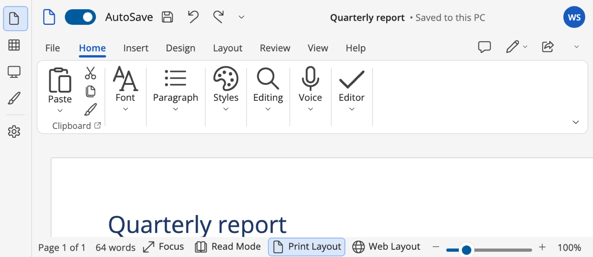
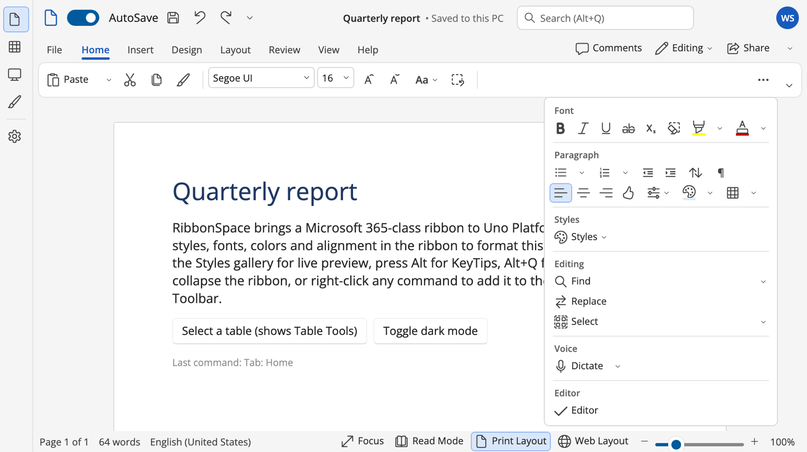

# Layout and sizing

## Adaptive group resizing

When a tab no longer fits, groups shrink step by step, as in modern Office apps:

1. Every group moves from **Large** to **Medium**. Groups with a higher `ReductionOrder` go first; ties go
   right-to-left.
2. Then every group moves from **Medium** to **Small**.
3. Then groups **collapse** into a single drop-down button that shows the full group in a popup. Set
   `CanCollapse="False"` to prevent this.
4. If even that does not fit, the tab scrolls with arrow buttons and the mouse wheel.



Groups are measured in every state and the widths are cached, so resizing never guesses. The algorithm
(`RibbonAdaptiveLayout`) lives in Core and is unit tested.

### Size definitions

An item's `SizeDefinition` maps the group state to the item size:

| `Size` (preferred) | Default `SizeDefinition` | Meaning in group states Large / Medium / Small |
|---|---|---|
| `Large` | `Large, Medium, Small` | big icon → icon + label row → icon only |
| `Medium` | `Medium, Small, Small` | icon + label → icon only |
| `Small` | `Small` | always icon only |

```xml
<RibbonSplitButton Label="Paste" SizeDefinition="Large" />          <!-- always large (Office Paste) -->
<RibbonButton Label="Find" Size="Large" SizeDefinition="Large, Large, Medium" />
```

Galleries show `MaxColumns` in the Large state and `MinColumns` in the Medium state, and become a drop-down button
in the Small state.

### Group item layouts

- `ItemsLayout="Columns"` (default): large items take a full column; medium and small items stack in columns of
  `RowCount` (3 by default, or 2).
- `ItemsLayout="Rows"`: each child is a row, usually a `RibbonStackPanel` containing combo boxes and
  `RibbonButtonGroup`s, like the Office Font and Paragraph groups. Rows are distributed vertically.

## Simplified ribbon

`DisplayMode="Simplified"` gives Office's single-line ribbon:
- Items become compact.
- Labels are shown for items whose preferred size is Large. Override this with `SimplifiedLabel="Show"` or
  `SimplifiedLabel="Hide"`.
- Items that don't fit move into the **More options (⋯)** menu, which shows linked copies grouped by group.



Control each item with `SimplifiedVisibility`:

| Value | Behaviour |
|---|---|
| `Auto` | in the line while space permits |
| `Pinned` | overflows last |
| `Overflow` | always in the ⋯ menu |
| `Hidden` | never shown in simplified mode |

Users can switch layouts from the display-options menu (`IsSimplifiedModeAvailable`).

## Visibility modes

| `VisibilityMode` | Behaviour |
|---|---|
| `AlwaysShow` | tabs and commands |
| `TabsOnly` (`IsMinimized`) | clicking a tab shows the commands in a temporary popup over the content; Ctrl+F1 or double-clicking a tab toggles it |
| `FullScreen` | ribbon hidden behind a thin reveal bar (⋯) |
| `PanelButtons` | one button per panel; clicking opens the panel (AutoCAD) |
| `PanelTitles` | panel titles only; clicking a title opens the panel (AutoCAD) |

`ReductionStrategy` chooses how groups shrink:
- `Stepwise` (default, Office): all groups go to Medium, then Small, then collapse.
- `GroupByGroup` (AutoCAD-like): the least important group collapses completely before the next one shrinks.

`MinimizeBehavior` chooses what Ctrl+F1, a tab double-click and the minimize button do (tabs only, panel titles,
panel buttons, or AutoCAD's full cycle). `ShowGroupCaptions="False"` hides the panel titles. Expanded (slide-out)
panels, floating panels and the minimize button are described in [CAD ribbons](cad.md).

## Density and metrics

`Density` = `Comfortable` (mouse), `Compact` (CAD / pro tools) or `Touch`. For a fully custom look, set
`CustomMetrics`:

```csharp
ribbon.CustomMetrics = RibbonMetrics.Comfortable with { LargeItemHeight = 76, GroupContentHeight = 78, LargeIconSize = 36 };
```

`RibbonMetrics` contains tab height, group content and caption heights, large / row / simplified item heights,
large and small icon sizes, font sizes and item padding.

## Right-to-left

Set `FlowDirection="RightToLeft"` on the ribbon (or the window). All panels are mirrored by the framework.
