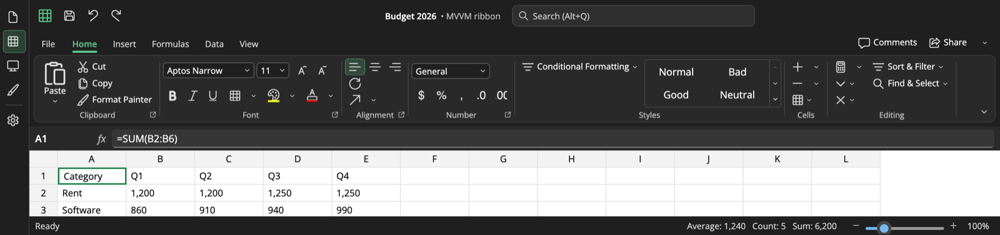

# Theming

## Light, dark and high contrast

All controls use `{ThemeResource Ribbon…Brush}` keys, defined in `RibbonThemeResources` for **Light**, **Dark** and
**HighContrast**. Themes follow `RequestedTheme`:

```csharp
RibbonTheme.SetTheme((FrameworkElement)window.Content, ElementTheme.Dark);
```



## Palettes and chrome styles

```csharp
RibbonTheme.ApplyPalette(RibbonThemePalette.Excel);                 // Word, Excel, PowerPoint, Outlook, OneNote, Access,
                                                                    // Visio, Project, Publisher, Teams, Graphite
RibbonTheme.ApplyAccent(Windows.UI.Color.FromArgb(255, 0x14, 0x73, 0xE6));
RibbonTheme.ApplyChromeStyle(RibbonChromeStyle.Colorful);           // accent title bar / tab row (Office "Colorful")
RibbonTheme.Apply(RibbonThemePalette.FromAccent(RibbonColor.Parse("#8764B8"), "Purple"), RibbonChromeStyle.Neutral);
```

Palettes are applied **in place**: the existing brush instances change colour, so every control updates at once
without re-templating or rebuilding the UI. Each palette defines a light and a dark accent, both meeting contrast
requirements, and the tint, hover, checked and foreground colours are derived from it.

## Brush keys

Override any single brush:

```csharp
RibbonTheme.SetBrushColor("RibbonCommandBarBackgroundBrush", Colors.White, "Light");
```

Or define the key in your own resources, which take precedence over the built-in theme:

```xml
<ResourceDictionary.ThemeDictionaries>
  <ResourceDictionary x:Key="Light"><SolidColorBrush x:Key="RibbonTabIndicatorBrush" Color="HotPink" /></ResourceDictionary>
</ResourceDictionary.ThemeDictionaries>
```

| Area | Keys |
|---|---|
| Window and chrome | `RibbonWindowBackgroundBrush`, `RibbonChromeBackgroundBrush`, `RibbonChromeForegroundBrush`, `RibbonCommandBarBackgroundBrush`, `RibbonCommandBarBorderBrush` |
| Text and icons | `RibbonForegroundBrush`, `RibbonSecondaryForegroundBrush`, `RibbonDisabledForegroundBrush`, `RibbonIconBrush` |
| Accent | `RibbonAccentBrush`, `RibbonAccentForegroundBrush`, `RibbonAccentSubtleBrush`, `RibbonAccentSubtleStrongBrush`, `RibbonAccentTextBrush` |
| Items | `RibbonItemHoverBrush`, `RibbonItemPressedBrush`, `RibbonItemCheckedBrush`, `RibbonItemCheckedHoverBrush`, `RibbonItemCheckedBorderBrush`, `RibbonItemBorderHoverBrush`, `RibbonSeparatorBrush` |
| Tabs | `RibbonTabForegroundBrush`, `RibbonTabHoverBrush`, `RibbonTabSelectedForegroundBrush`, `RibbonTabIndicatorBrush` |
| Popups and inputs | `RibbonPopupBackgroundBrush`, `RibbonPopupBorderBrush`, `RibbonInputBackgroundBrush`, `RibbonInputBorderBrush`, `RibbonInputHoverBorderBrush`, `RibbonInputFocusBorderBrush` |
| KeyTips and ScreenTips | `RibbonKeyTipBackgroundBrush`, `RibbonKeyTipForegroundBrush`, `RibbonKeyTipBorderBrush`, `RibbonScreenTipBackgroundBrush`, `RibbonScreenTipBorderBrush` |
| Title bar | `RibbonTitleBarBackgroundBrush`, `RibbonTitleBarForegroundBrush`, `RibbonTitleBarHoverBrush`, `RibbonTitleBarIconBrush`, `RibbonSearchBackgroundBrush`, `RibbonSearchBorderBrush` |
| Backstage | `RibbonBackstagePaneBackgroundBrush`, `RibbonBackstagePaneForegroundBrush`, `RibbonBackstagePaneHoverBrush`, `RibbonBackstagePaneSelectedBrush`, `RibbonBackstageContentBackgroundBrush` |
| Other | `RibbonGalleryItemBorderBrush`, `RibbonGalleryItemSelectedBorderBrush`, `RibbonFocusBrush`, `RibbonStatusBarBackgroundBrush`, `RibbonStatusBarForegroundBrush`, `RibbonToolBarBackgroundBrush`, `RibbonSwatchBorderBrush`, `RibbonShadowBrush`, `RibbonScrollButtonBackgroundBrush` |

Code that builds visuals (custom popups, templates set up in code) should resolve brushes for the element's theme
rather than reading `Application.Current.Resources`, which only knows the application theme:

```csharp
RibbonTheme.SetThemeBrush(border, Border.BackgroundProperty, "RibbonPopupBackgroundBrush"); // follows theme changes
var brush = RibbonTheme.GetBrush(element, "RibbonAccentBrush");                           // one-off lookup
```

Other resources: `RibbonControlCornerRadius`, `RibbonCommandBarCornerRadius`, `RibbonPopupCornerRadius`, and the
keyed styles `RibbonChromeButtonStyle`, `RibbonApplicationButtonStyle`, `RibbonDialogLauncherButtonStyle`,
`RibbonMenuItemButtonStyle`, `RibbonGalleryItemStyle`, `RibbonSwatchButtonStyle`, `RibbonFlyoutPresenterStyle` and
`RibbonBackstageNavButtonStyle`.

## Re-templating

Every control is lookless. Copy a style from `src/RibbonSpace.Uno/Themes/*.xaml` into your resources and change it.
Keep the `PART_*` names. Item content is drawn by `RibbonItemContent`; set its properties from the template to change
icon or label placement.

Type names inside `TargetType` need a `using:` namespace (unprefixed RibbonSpace types work for elements, not for
attribute values). An app style adds to the built-in default style, so the template is kept unless you set one:

```xml
<ResourceDictionary xmlns:rs="using:RibbonSpace.Controls">
  <Style TargetType="rs:RibbonButton">
    <Setter Property="MinWidth" Value="48" />
  </Style>
</ResourceDictionary>
```

## Density and metrics

See [Layout](layout.md#density-and-metrics).
