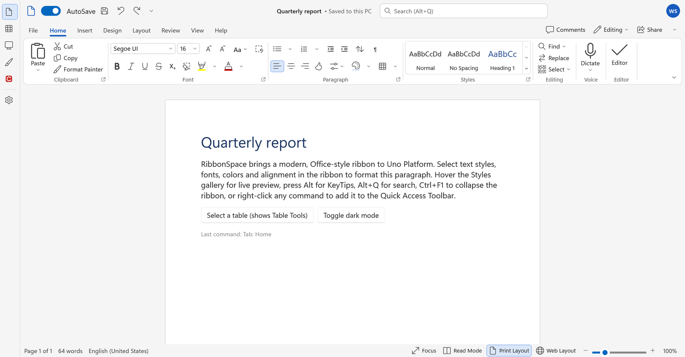

# WinUI 3 (Windows App SDK)

`RibbonSpace.WinUI` is RibbonSpace for plain WinUI 3 apps, without Uno Platform. It has the same controls, MVVM layer,
themes and behaviour as `RibbonSpace.Uno`. It is compiled from the same source files, so features and fixes land in
both at once.



## Which package?

| App | Package |
|---|---|
| Uno Platform app (any head, including its WinAppSDK head) | `RibbonSpace.Uno` |
| WinUI 3 app (Windows App SDK, no Uno) | `RibbonSpace.WinUI` |

Both depend on `RibbonSpace.Core`, the UI-agnostic models and algorithms.

## Install

```bash
dotnet add package RibbonSpace.WinUI
```

Requirements:
- .NET 10
- Windows App SDK 1.7 or later
- target framework `net10.0-windows10.0.19041.0` or later
- Windows 10 1809 (17763) or later

The gallery and the runtime UI tests run as unpackaged apps that bundle the Windows App SDK runtime
(`WindowsPackageType=None`, `WindowsAppSDKSelfContained=true`).

## Your first ribbon

WinUI's XAML compiler only resolves `using:` namespaces, so declare a prefix:

```xml
<Window x:Class="MyApp.MainWindow"
        xmlns="http://schemas.microsoft.com/winfx/2006/xaml/presentation"
        xmlns:x="http://schemas.microsoft.com/winfx/2006/xaml"
        xmlns:rs="using:RibbonSpace.Controls">
  <Grid RowDefinitions="Auto,Auto,*">
    <rs:RibbonTitleBar Title="Report" AppIcon="&#xE8A5;" Ribbon="{x:Bind Ribbon}" />
    <rs:Ribbon x:Name="Ribbon" Grid.Row="1" ItemInvoked="OnItemInvoked">
      <rs:RibbonTab Id="home" Header="Home">
        <rs:RibbonGroup Id="clipboard" Header="Clipboard">
          <rs:RibbonButton Id="paste" Label="Paste" Icon="&#xE77F;" Size="Large" />
          <rs:RibbonButton Id="cut" Label="Cut" Icon="&#xE8C6;" />
          <rs:RibbonButton Id="copy" Label="Copy" Icon="&#xE8C8;" />
        </rs:RibbonGroup>
      </rs:RibbonTab>
    </rs:Ribbon>
  </Grid>
</Window>
```

Use `using:RibbonSpace.Controls.Primitives` for primitives such as `RibbonIconPresenter`. Everything else in the
guides applies unchanged: MVVM with `RibbonModel`, commands, KeyTips, the QAT, backstage, theming and state.

The theme resources merge themselves into `Application.Resources` when the first RibbonSpace control is created. If
your own XAML uses RibbonSpace brushes (`{ThemeResource RibbonWindowBackgroundBrush}`) before that happens, merge
them in App.xaml:

```xml
<ResourceDictionary.MergedDictionaries>
  <XamlControlsResources xmlns="using:Microsoft.UI.Xaml.Controls" />
  <rs:RibbonThemeResources xmlns:rs="using:RibbonSpace.Controls" />
</ResourceDictionary.MergedDictionaries>
```

`RibbonTitleBar.AttachToWindow(window)` extends the content into the window title bar. It uses the system caption
button insets from `AppWindow` and keeps the QAT, search and custom content interactive through passthrough regions.

## How the port is built

`src/RibbonSpace.WinUI` contains only a project file. It compiles the `RibbonSpace.Uno` sources through MSBuild links,
which makes `RibbonSpace.Uno` the single source of truth. The WinUI gallery (`samples/RibbonSpace.WinUI.Demo`) and
runtime UI tests (`tests/RibbonSpace.WinUI.RuntimeTests`) link the Uno gallery and test sources the same way. Each
adds only a `Program.cs` host, as each Uno head does.

`build/WinUI/RibbonSpace.WinUI.targets` holds the shared settings. Before each build it adapts the linked XAML for the
WinUI XAML compiler and writes the result to `obj/`:
- Uno resolves RibbonSpace types written without a prefix, through the `https://github.com/wieslawsoltes/RibbonSpace`
  namespace, or with the undeclared `rs:` prefix. The adapter moves those elements, property elements and attached
  properties to `using:RibbonSpace.Controls[.Primitives|.Mvvm]`. The sample and test XAML therefore stays unprefixed.
- Resource URIs carry the assembly name, so the adapter rewrites `ms-appx:///RibbonSpace.Uno/` to
  `ms-appx:///RibbonSpace.WinUI/` in the library themes.

The package contains the assembly, its PRI index and the compiled theme layout (`RibbonSpace.WinUI/Themes/*.xbf`).

## Writing code that works on both

Shared code compiles for both platforms. `#if WINDOWS` selects Windows App SDK-only APIs, such as `AppWindow` title
bar insets. WinUI is stricter than Uno in a few places, and the runtime UI tests catch these on both:
- **Content properties** must be declared with `[ContentProperty(Name = nameof(Items))]`. Uno infers them.
- **ThemeDictionaries** need one `ResourceDictionary` instance per key. Sharing one instance between `Light` and
  `Default` fails on WinUI.
- **Subclassed controls** need their own `DefaultStyleKey` and their own implicit style, `BasedOn` the base style
  (`DefaultRibbonButtonStyle`, `DefaultRibbonSplitButtonStyle` and `DefaultRibbonComboBoxStyle`). WinUI only applies a
  style to types its XAML type information knows.
- **Library `Generic.xaml` resources** are not visible to application XAML on WinUI. They only provide default
  styles. Look resources up through `RibbonThemeResources` or `Application.Current.Resources`.
- **`x:Name` values** that match inherited members (`FontSize`, `Language`) hide them and cause warnings.

## Build, run and test

On Windows with the .NET 10 SDK (no Visual Studio needed):

```bash
dotnet build RibbonSpace.WinUI.slnx
dotnet run --project samples/RibbonSpace.WinUI.Demo
dotnet run --project tests/RibbonSpace.WinUI.RuntimeTests
```

The apps target the machine's architecture (`win-x64` or `win-arm64`) unless you pass `-p:Platform=x64` or
`-p:Platform=ARM64`. The runtime test runner and the gallery's screenshot automation work as described in
[Testing](testing.md).

`dotnet build` reports XAML errors only as `XamlCompiler.exe exited with code 1`. For the messages, build once with
Visual Studio's MSBuild and the in-process compiler:

```bash
msbuild samples/RibbonSpace.WinUI.Demo -restore -p:UseXamlCompilerExecutable=false
```
